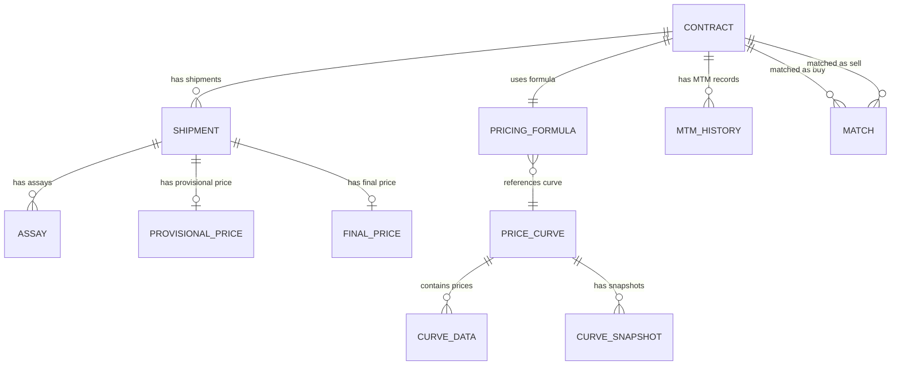

# 01 — Domain Model

## Core Entities



## Entity Responsibilities

| Entity              | Responsibility                                                    |
|---------------------|-------------------------------------------------------------------|
| **Contract**        | Core trade: direction, counterparty, quantity, pricing terms      |
| **Shipment**        | Physical execution: vessel, BL date/qty, load/discharge ports     |
| **Assay**           | Quality analysis: Fe%, moisture, impurities (provisional/final)   |
| **Price Curve**     | Reference index definition (e.g. TSI 62% Fe CFR China)           |
| **Curve Data**      | Time series: daily prices for a curve                             |
| **Curve Snapshot**  | Point-in-time capture of curve data (for MTM history)             |
| **Pricing Formula** | Structured pricing logic: base curve, QP rule, adjustments        |
| **Provisional/Final Price** | Computed price breakdown per shipment                     |
| **MTM History**     | Daily mark-to-market record per contract                          |
| **Match**           | Links a buy contract to a sell contract with matched quantity      |

## Key Relationships

- A **Contract** has one **Pricing Formula** and zero-to-many **Shipments**
- A **Shipment** has zero-to-two **Assays** (provisional + final)
- A **Pricing Formula** references one **Price Curve** as its base
- **MTM History** references both a **Contract** and a curve price snapshot
- **Matches** link pairs of buy/sell contracts with a matched quantity

## Lifecycle Flow

```
Contract (Draft → Confirmed → Executed → Closed)
    └── Shipment (Nominated → Loaded → Discharged → Completed)
            ├── Provisional Assay → Provisional Price
            └── Final Assay → Final Price → P&F Settlement
```
